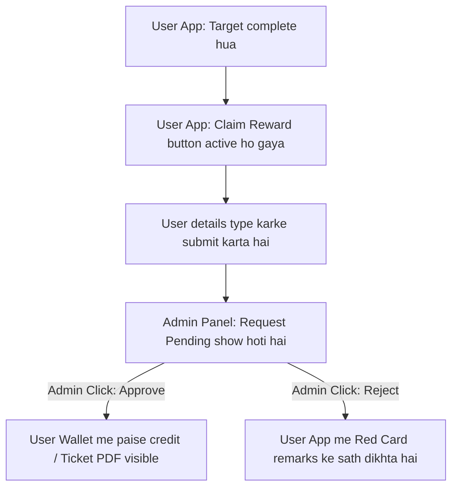

# MLM Reward Claims & Monthly Funds - User Guide (Hinglish)

Yeh guide aapko naye MLM Reward Claims aur Monthly Funds system ke workflow aur testing process ko simple language me samajhne me help karegi. Isme koi technical details nahi hain, sirf wahi flow hai jo User ko Mobile App me aur Admin ko Admin Panel me dikhega.

---

## 📋 System Kaise Kaam Karta Hai?

Pehle system me monthly payouts automatic user ke wallet me chale jate the. Naye system me ek **Claim Request Flow** banaya gaya hai:

1. **Qualification Status**: Jab koi user target complete karta hai, toh use direct wallet me paise nahi milte.
2. **User Claim Button**: User ke Mobile App me "My Rewards" section me ek status update ho jata hai aur wahan **"Claim Reward"** button active ho jata hai.
3. **User Submit Request**: User is button par click karke apne payment details (Bank Info, UPI) ya travel details (Tours ke liye passenger info) type karke submit karta hai.
4. **Admin Approval**: Admin panel ke "Reward & Fund Claims" dashboard par yeh request dikhti hai. Admin verification ke baad use **Approve** (wallet me payout dalne ke liye) ya **Reject** (feedback message ke sath) kar sakta hai.
5. **Fulfillment Receipt**: Approved hone ke baad, agar tour ticket ya insurance policy hai, toh admin dwara upload kiya gaya PDF user ko unke app inbox me download ke liye mil jata hai.

---

## ⚡ Main Features

1. **Progress Bar**: Mobile app me user ko ek scale/progress bar dikhegi jo batayegi ki unka personal purchase target (1,000 BV) aur group target kitna complete ho chuka hai.
2. **Activity Check Rules**: Leader rank ke liye pichle 12 mahino me 3,000 personal BV aur Team Leader+ ranks ke liye 12,000 personal BV maintain hona chahiye. Agar user yeh maintain nahi kar pata, toh 2nd alternate options automatic verify ho jate hain.
3. **Sponsor Active Check**: Agar user ka direct sponsor pichle 6 mahine se inactive hai (koi purchase nahi kiya), toh user ka monthly reward tab tak pause rahega jab tak unka sponsor purchase nahi karta.
4. **Reward Limits (Capped Months)**:
   * **Bike Fund**: Max 24 months tak hi claim kiya ja sakta hai.
   * **Car Fund**: Max 36 months tak hi claim kiya ja sakta hai.
   * **House Fund**: Max 60 months tak hi claim kiya ja sakta hai.
5. **Manual Bypass Option**: Agar koi user thode se point se target miss kar deta hai, toh Admin panel se admin directly unka username enter karke manually qualify kar sakta hai.

---

## 🔄 User aur Admin Panel Flow

---

## 🎭 Scenarios (Real-world Examples)

### **Scenario A: Ramesh ka Bike Fund (Monthly Cash Reward)**
* **User Profile**: Ramesh (Assistant Supervisor rank par hain).
* **Monthly Target**: 1,000 Personal BV aur 1,00,000 Group BV complete karna.
1. **Target Qualified**: Ramesh target complete karte hain. App me unke liye **Claim ₹2,500** active ho jata hai.
2. **Submit Claim**: Ramesh app me apna Bank A/C details enter karke click karte hain **Submit**.
3. **Admin Process**: Admin panel me Ramesh ki request Pending dikhti hai. Admin click karta hai **PROCESS** -> **APPROVE**.
4. **Result**: Ramesh ke wallet me ₹2,500 aa jate hain aur unka paid month counter 23 se badhkar 24 (limit complete) ho jata hai.

### **Scenario B: Suresh ka Domestic Tour (Physical Reward)**
* **User Profile**: Suresh (achieves Supervisor rank).
* **Reward Benefit**: 2 Days / 3 Nights Tour ticket.
1. **Dashboard Check**: Suresh Supervisor bante hi app me "Domestic Tour" ke aage **CLAIMABLE** status dekhte hain.
2. **Submit Info**: Suresh ticket booking details enter karke send karte hain.
3. **Admin Process**: Admin ticket book karke ticket PDF file upload kar deta hai aur click karta hai **APPROVE**.
4. **Result**: Suresh app me Inbox section me green color me **APPROVED** status dekhte hain aur boarding pass download kar lete hain.

---

## 🛠️ Step-by-Step Client Testing Guide (Test Kaise Karein?)

Staging environment par test karne ke liye unhe yeh simple steps follow karne ko kahein:

### **Step 1: Admin Panel se Manual Bypass chalayein**
1. Admin Panel me log in karein aur **Reward & Fund Claims** page par jayein.
2. **MANUAL BYPASS / OVERRIDE** button par click karein.
3. Form me details enter karein:
   * **Username**: Jis user ke sath test karna hai (Jaise: `Ram`).
   * **Reward Type**: `Bike Fund` select karein.
   * **Payout Amount (₹)**: `2500`
   * **Claim Month**: Current month dropdown se select karein.
   * **Override Notes**: *"Manual bypass test for verification"* type karein.
4. Click **APPLY OVERRIDE**.

### **Step 2: User Mobile App se Claim details submit karein**
1. User Mobile App me user account se log in karein (e.g. `Ram`).
2. Wallet Dashboard me **My Rewards & Funds** card par click karein.
3. **Inbox / History** tab select karein.
4. Wahan aapko **Bike Fund (₹2,500)** request **PENDING** dikhegi.
5. **Update Request Details** (ya **Claim**) button click karein.
6. Bank detail type karein: *"Bank Name: Test Bank, A/C: 987654321, UPI: ram@upi"* aur click karein **Submit Claim**.

### **Step 3: Admin Panel se Approve karein**
1. Admin Panel ke Claims page par dubara jayein.
2. `Ram` ki claim request ab user-submitted details ke sath visible hogi.
3. Action button me click karein **PROCESS**.
4. Remarks me *"Approved on testing"* type karein.
5. Click **APPROVE CLAIM**.

### **Step 4: Final Output Verification**
1. **Wallet check**: Mobile app me Ram ka wallet balance check karein, wahan ₹2,500 credit ho chuka hoga.
2. **Inbox check**: Mobile app ke Inbox section me request status green color me **APPROVED** show karegi.
